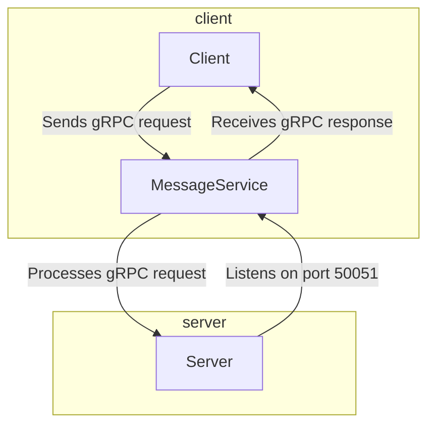

# Golang + gRPC + Docker Compose example

The gRPC Message Service is a simple client-server application built using the gRPC in Go.

## gRPC Docs

https://grpc.io/

## Run

```bash
docker-compose up
```

## Services schema



License
This project is licensed under the MIT License.
